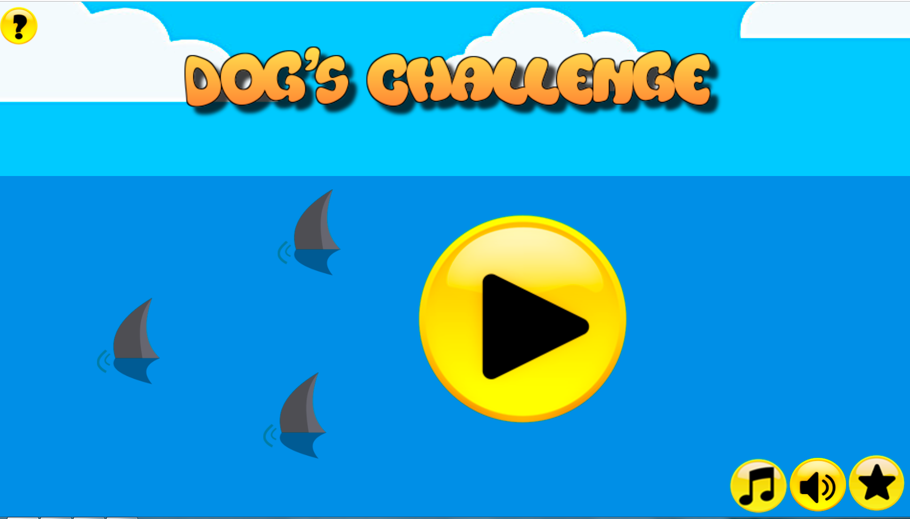
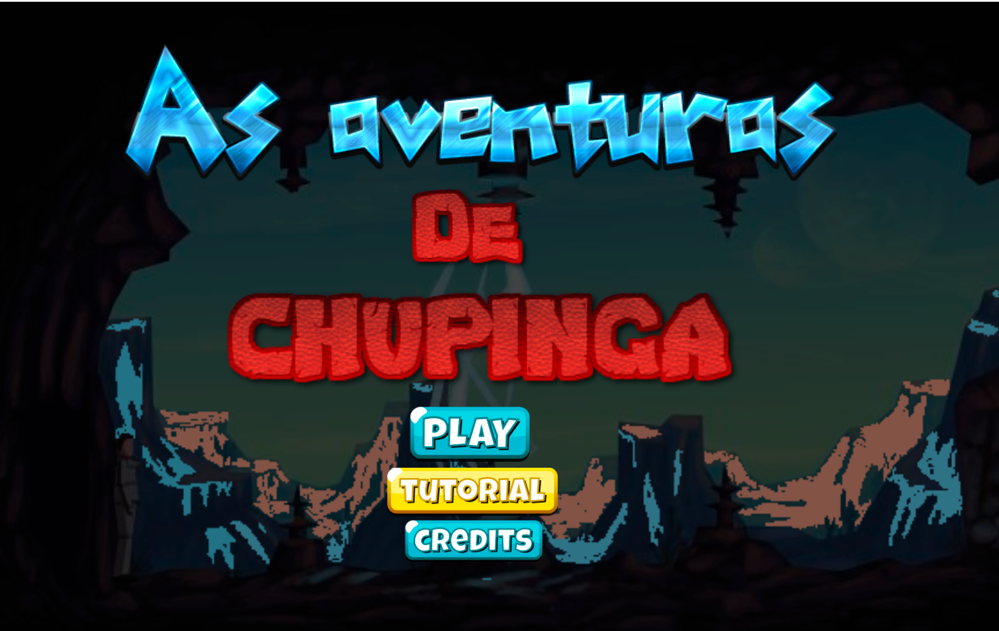

# MEU PORTIFÓLIO 

Claudia Santos, cursando Programação de Jogos Digitais, no IFRN - _Campus_ Ceará-Mirim.

## CONTATOS

### 1. Email acadêmico: 

claudia.s@academico.ifrn.edu.br

### 2. E-mail pessoal: 

clauj219@gmail.com

### 3. Facebook: 

Claudia Santos

### 4. Instagram

@claudiasantosz

## JOGOS

### 1. Dog Challenge

#### <a href = " https://ruanaffff.github.io/CAOZINHOGUB/ " target="_blank"> Cão </a> 

### 2. Size Companions

#### <a href = " https://danilo25.github.io/SizeCompanions2/ " target="_blank"> Size Companions </a> 

### 3. As Aventuras de Chupinga

#### <a href = " https://ruanaffff.github.io/Chupinga/ " target="_blank"> As Aventuras de Chupinga  </a> 

### 4. Mãe, quem apagou a luz?

#### <a href = " https://erikyjoseph.github.io/maequemapagou/ " target="_blank"> Mãe, quem apagou a luz?  </a>

